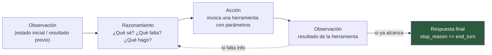
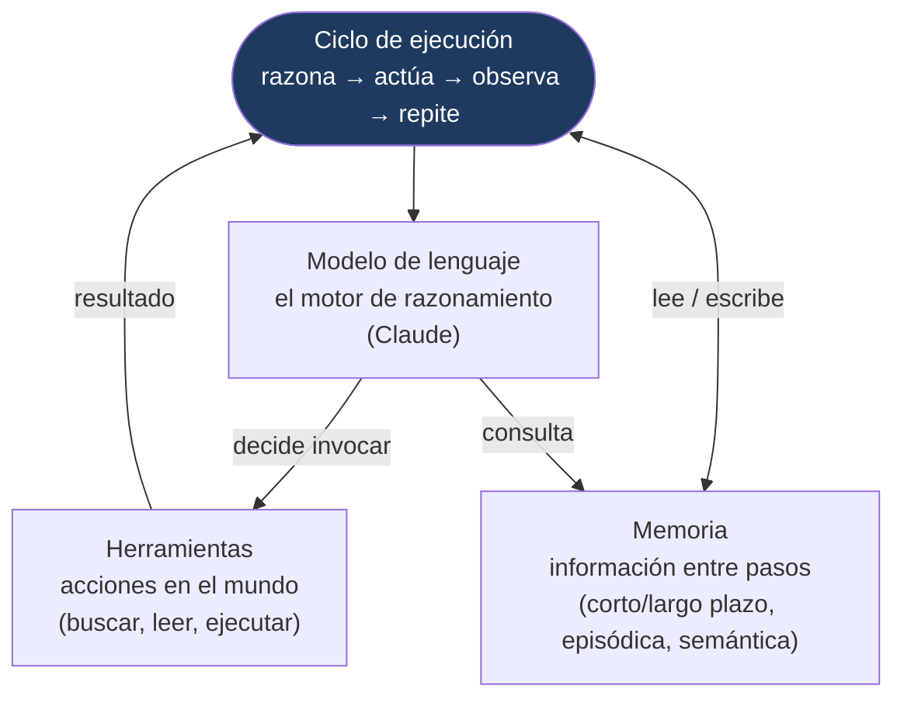
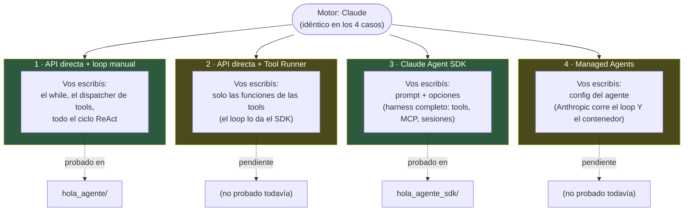
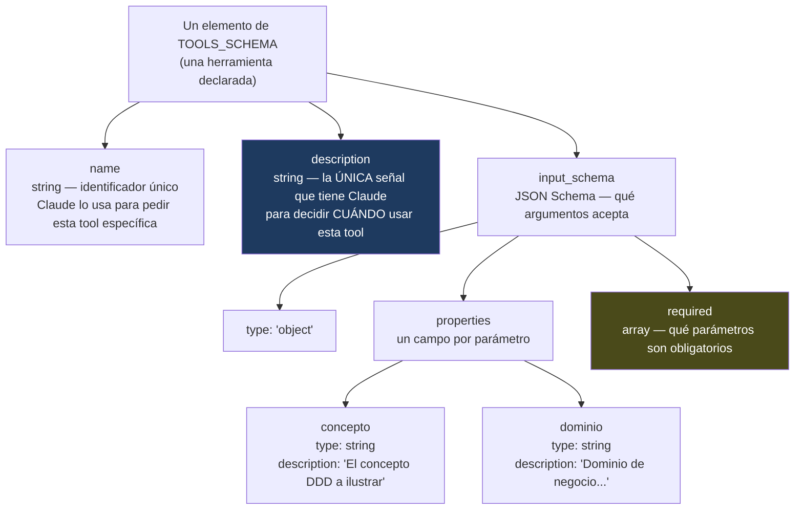

# Diagramas de conceptos — síntesis visual

> Documentación visual de los conceptos desarrollados en Etapas 1 y 2. No reemplaza
> a `modelo_mental_agentico.md` ni a los README de cada prototipo — es un resumen
> para repasar de un vistazo, con referencias a dónde profundizar cada cosa.

---

## 1. El ciclo ReAct

El corazón de cualquier agente: razonar, actuar, observar, repetir hasta terminar.
Detalle completo en [`modelo_mental_agentico.md`](modelo_mental_agentico.md#3-el-ciclo-react).

**Dónde lo vi en código:** el `while True` de `react_loop()` en
[`hola_agente/agente_ddd.py`](../../01_prototipos/hola_agente/agente_ddd.py) — cada
vuelta del loop es exactamente uno de estos ciclos, con la diferencia de que un solo
ciclo puede disparar varias acciones (tool calls) antes de volver a razonar.

---

## 2. Estructura de un agente

Un agente no es "un LLM con más pasos" — es un sistema de cuatro piezas que se
retroalimentan. Sacar cualquiera de las cuatro rompe la definición: sin herramientas
solo hay texto, sin memoria cada paso arranca de cero, sin ciclo no hay repetición.

**Dónde lo vi en código:** en `hola_agente_sdk/agente_ddd_sdk.py`, el `GLOSARIO_DDD`
es la Memoria (semántica, aunque hardcodeada), `buscar_termino_ddd` es la Herramienta,
`query(prompt, options)` es el Ciclo de ejecución — provisto por el SDK en vez de
escrito a mano — y Claude sigue siendo el Modelo en los tres casos.

---

## 3. Tipos de harness

El harness es el andamiaje que rodea al modelo y lo convierte en agente: decide
cuándo llamarlo, cómo ejecuta las tools, y qué historial mantiene. El motor (Claude)
es el mismo en los cuatro casos — lo que cambia es cuánto de ese andamiaje escribís
vos y cuánto viene dado.

**La distinción que más importa:** las opciones 1, 2 y 3 dejan el *deployment* en tus
manos — vos corrés el proceso, donde sea que lo corras. Solo la opción 4 (Managed
Agents) gestiona también la infraestructura: ni siquiera hace falta un proceso
Python corriendo en tu máquina.

---

## 4. Anatomía de `TOOLS_SCHEMA`

`TOOLS_SCHEMA` es lo que el *modelo ve* de cada herramienta — nombres, descripciones
y parámetros. No es la implementación: es la declaración que le permite a Claude
decidir *cuándo* pedir una tool y *con qué argumentos*, sin ejecutar nada él mismo.
Cada elemento de la lista tiene la misma forma, sin importar qué haga la tool por
dentro.

**Ejemplo real:** la tool `generar_codigo` de
[`hola_agente/agente_ddd.py`](../../01_prototipos/hola_agente/agente_ddd.py) — dos
parámetros (`concepto`, `dominio`), ambos obligatorios según `required`.

**El punto que no es obvio a simple vista:** `TOOLS_SCHEMA` (lo que Claude *ve*) y
`TOOLS_IMPL` (lo que el código *ejecuta*) son dos estructuras separadas que conviven
en el mismo archivo, conectadas solo por el `name`. Claude nunca toca `TOOLS_IMPL`
— ese dispatcher es puro Python de tu lado. Esta separación es la misma que después
el Claude Agent SDK esconde detrás del decorador `@tool` en `hola_agente_sdk`: ahí
`TOOLS_SCHEMA` e implementación se declaran juntos, pero conceptualmente siguen
siendo las dos mismas piezas.

---

## Cómo se relacionan los cuatro diagramas

El diagrama 1 (ReAct) describe el *comportamiento* — qué pasa en cada paso. El
diagrama 2 (estructura del agente) describe los *componentes* — qué piezas hacen
falta para que ese comportamiento sea posible. El diagrama 3 (harness) describe
*quién construye esas piezas* — vos a mano, un SDK, o un servicio gestionado. El
diagrama 4 (`TOOLS_SCHEMA`) baja un nivel más y muestra la forma concreta de una
sola de esas piezas — la Herramienta del diagrama 2 — tal como Claude la percibe.
Los cuatro capturan el mismo sistema desde ángulos distintos: proceso, arquitectura,
responsabilidad de implementación, y detalle de una pieza puntual.

---

*Creado: Agosto 2026 | Referencia visual de Etapas 1–2 | Se actualiza si los
conceptos base cambian en `modelo_mental_agentico.md`*
