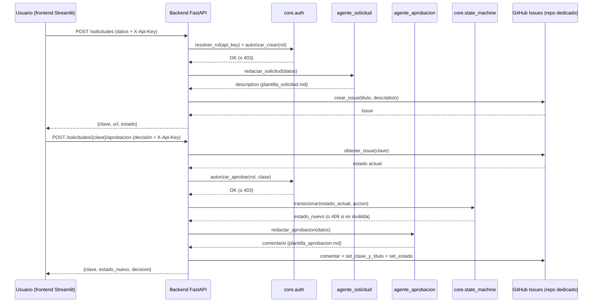
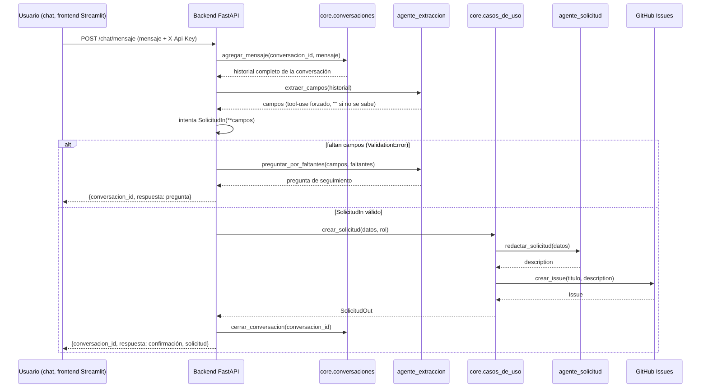
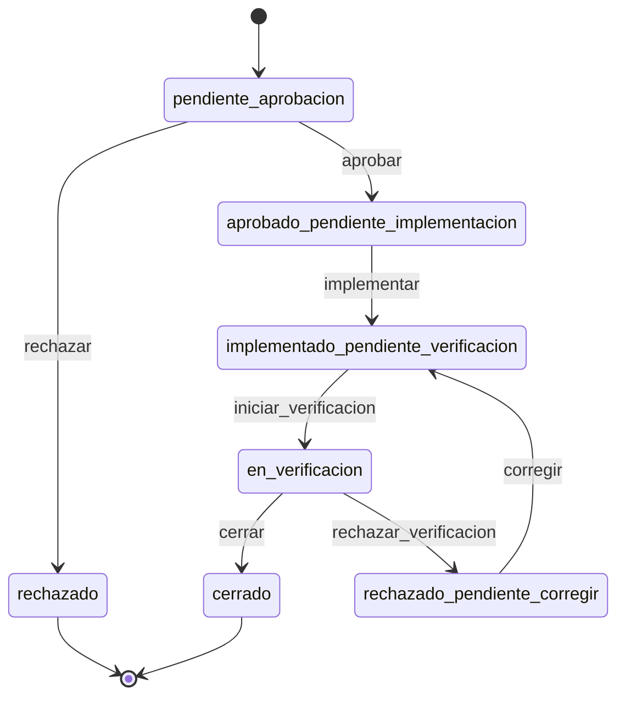

# Arquitectura — asistente_gestion_cambios (POC)

## Flujo del POC: Solicitud → Aprobación



Puntos de control marcados explícitamente en el diagrama: la autorización
(`core.auth`) y la validación de transición (`core.state_machine`) ocurren
**antes** de invocar al agente o de tocar GitHub — un 403 o un 409 corta el
flujo sin efectos secundarios.

## Flujo alternativo: canal chat (Módulo 1)

El formulario y el chat terminan en el mismo lugar — `core.casos_de_uso`
— para no duplicar autorización, redacción ni publicación entre canales.
Lo único distinto es cómo se llega a un `SolicitudIn` válido: el
formulario ya lo manda completo; el chat lo arma de a poco.



`extraer_campos()` recibe el historial completo en cada turno (no solo el
último mensaje) y le pide al modelo el mejor valor conocido para cada
campo — el merge entre turnos lo hace el modelo, no hay lógica de fusión
en Python. Qué falta se detecta reusando la validación de `SolicitudIn`
que ya existía para el formulario: los errores de Pydantic son
exactamente los campos que faltan, sin mantener una lista de
"requeridos" aparte.

Dos llamadas acotadas por turno, no un loop ReAct abierto — mismo
principio que `agente_solicitud`/`agente_aprobacion`: el código orquesta,
el modelo redacta o extrae en pasos angostos.

## Máquina de estados (7 estados, heredada del workflow de Jira original)



Implementado en `backend/core/state_machine.py`. Cada estado se representa
como un label `estado:*` sobre el Issue de GitHub (ej.
`estado:pendiente-aprobacion`); GitHub no valida transiciones por sí solo,
así que esta tabla es la que reemplaza al workflow configurable de Jira.

Este POC solo tiene routers para las transiciones `aprobar` y `rechazar`
(Módulo 2). El resto de la tabla ya existe para cuando se implementen los
Módulos 3, 4 y 5.

## Estructura de carpetas

```
asistente_gestion_cambios/
├── backend/
│   ├── main.py                FastAPI app
│   ├── config.py              Carga de .env
│   ├── core/
│   │   ├── state_machine.py   Máquina de estados (agnóstica de GitHub)
│   │   ├── auth.py            Roles y autorización (agnóstica de GitHub)
│   │   ├── casos_de_uso.py    Lógica de negocio compartida entre canales
│   │   ├── conversaciones.py  Estado del chat en memoria (sin persistencia)
│   │   ├── github_tracker.py  Wrapper PyGithub — únicas llamadas a la API externa
│   │   └── models.py          Esquemas Pydantic de entrada/salida
│   ├── agents/                 Un módulo por agente (Claude, sin tools propias)
│   │   ├── agente_solicitud.py    Redacta description desde datos limpios
│   │   ├── agente_extraccion.py   Inverso: extrae datos limpios desde texto libre
│   │   └── agente_aprobacion.py   Redacta comentario de aprobación
│   ├── assets/                 Plantillas de redacción
│   └── routers/                 Un router por canal/endpoint
│       ├── _common.py             Dependency de auth compartida entre routers
│       ├── solicitudes.py         Canal formulario (Módulo 1)
│       ├── chat.py                Canal chat (Módulo 1)
│       └── aprobaciones.py        Módulo 2
└── frontend/
    └── app.py                 Cliente Streamlit puro — solo llama a la API
```

`core/state_machine.py` y `core/auth.py` no dependen de PyGithub ni de
Anthropic — son lógica de negocio pura, testeada de forma aislada (ver
sesión de implementación). `github_tracker.py` es la única capa que sabe
que el backend está "hoy" sobre GitHub; cambiar de tracker en el futuro
no debería tocar `state_machine.py` ni `auth.py`.

`core/casos_de_uso.py` es lo que permite que `solicitudes.py` (formulario)
y `chat.py` terminen en el mismo lugar: ninguno de los dos routers
autoriza, redacta ni publica por su cuenta — arman un `SolicitudIn` (uno
lo recibe completo, el otro lo arma con `agente_extraccion`) y delegan.
Un tercer canal (mail, por ejemplo) solo necesitaría producir ese mismo
`SolicitudIn` para reusar todo lo demás sin tocar nada.
