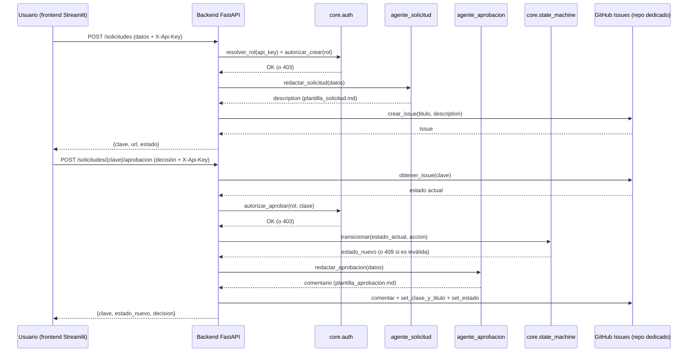
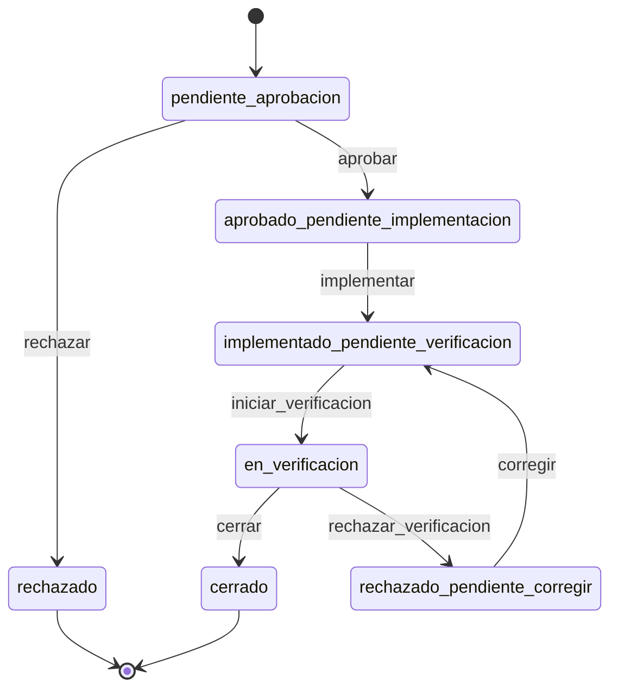

# Arquitectura — asistente_gestion_cambios (POC)

## Flujo del POC: Solicitud → Aprobación



Puntos de control marcados explícitamente en el diagrama: la autorización
(`core.auth`) y la validación de transición (`core.state_machine`) ocurren
**antes** de invocar al agente o de tocar GitHub — un 403 o un 409 corta el
flujo sin efectos secundarios.

## Máquina de estados (7 estados, heredada del workflow de Jira original)



Implementado en `backend/core/state_machine.py`. Cada estado se representa
como un label `estado:*` sobre el Issue de GitHub (ej.
`estado:pendiente-aprobacion`); GitHub no valida transiciones por sí solo,
así que esta tabla es la que reemplaza al workflow configurable de Jira.

Este POC solo tiene routers para las transiciones `aprobar` y `rechazar`
(Módulo 2). El resto de la tabla ya existe para cuando se implementen los
Módulos 3, 4 y 5.

## Estructura de carpetas

```
asistente_gestion_cambios/
├── backend/
│   ├── main.py              FastAPI app
│   ├── config.py            Carga de .env
│   ├── core/
│   │   ├── state_machine.py Máquina de estados (agnóstica de GitHub)
│   │   ├── auth.py          Roles y autorización (agnóstica de GitHub)
│   │   ├── github_tracker.py Wrapper PyGithub — únicas llamadas a la API externa
│   │   └── models.py        Esquemas Pydantic de entrada/salida
│   ├── agents/               Un módulo por agente (Claude, sin tools propias)
│   ├── assets/                Plantillas de redacción
│   └── routers/                Un router por endpoint de módulo
└── frontend/
    └── app.py                Cliente Streamlit puro — solo llama a la API
```

`core/state_machine.py` y `core/auth.py` no dependen de PyGithub ni de
Anthropic — son lógica de negocio pura, testeada de forma aislada (ver
sesión de implementación). `github_tracker.py` es la única capa que sabe
que el backend está "hoy" sobre GitHub; cambiar de tracker en el futuro
no debería tocar `state_machine.py` ni `auth.py`.
